## IMPLEMENTING LEMP WEB STACK ON AWS

### Step 1: Installing the nginx web server

> SSH into your instance

> Update software packages and Install nginx

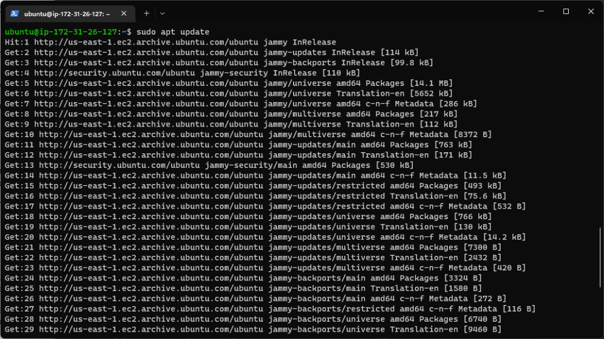

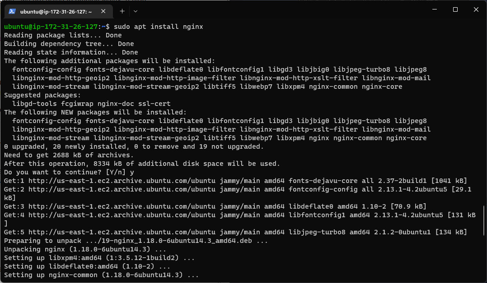

> Verify ngin was successfully installed

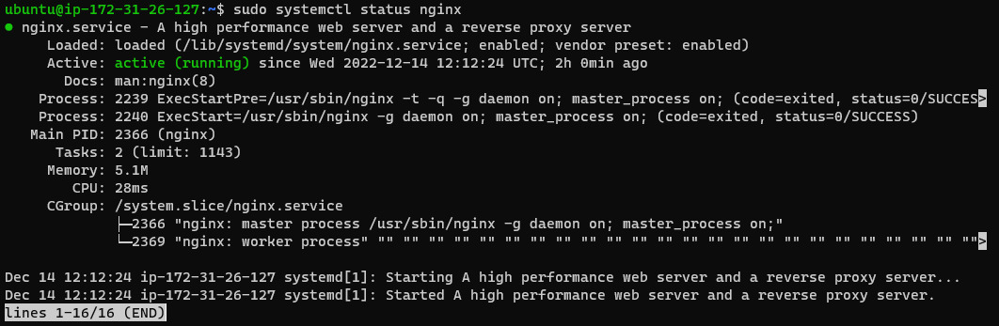

> Access the nginx locally

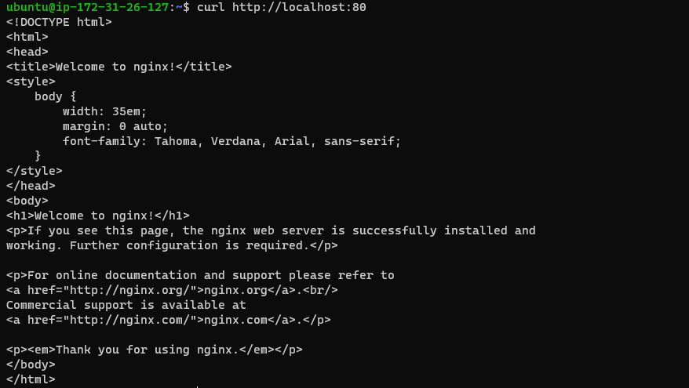 
   
    curl http://localhost:80

> Accessing nginx from a web broswer

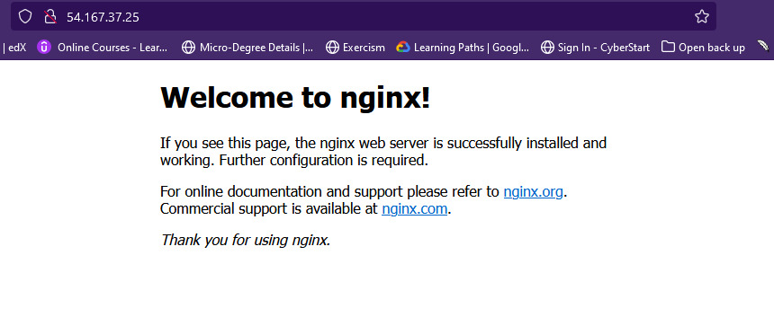


## STEP 2 - INSTALLING MySQL

> Installing mysql-server
  
    sudo apt install mysql-server

  

> Log into the MySQL console 
   
    sudo mysql

  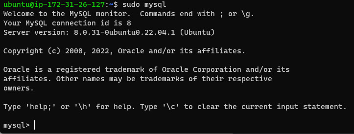

> Setting a pssword for the root user

    ALTER USER 'root'@'localhost' IDENTIFIED WITH mysql_native_password BY 'PassWord.1';
  
  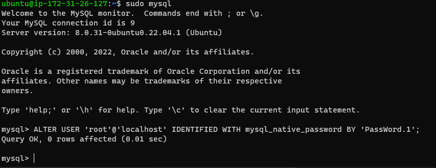

> Exit the MySQL shell
  
    exit 
  
  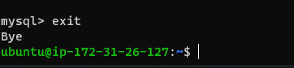

> Start the interactive script by running
    
    sudo mysql_secure_installation
  
  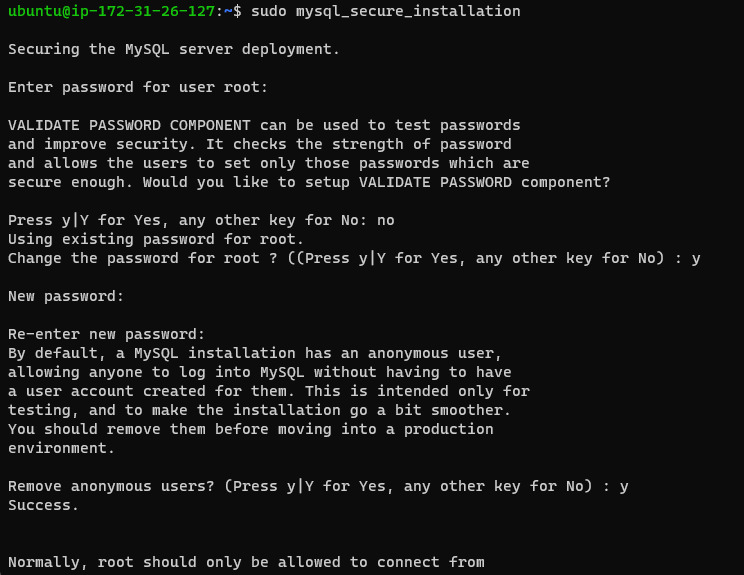

> Log in to the MySQL console
  
    sudo mysql -p
  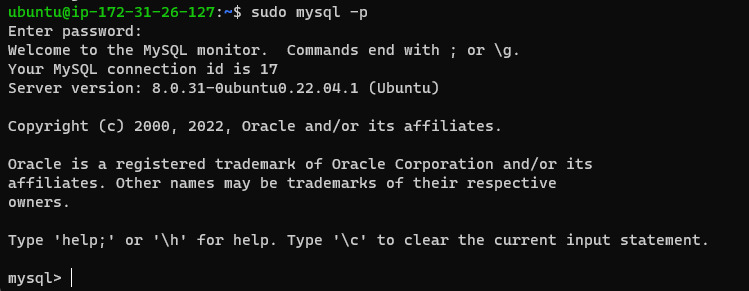

> Exit the MySQL shell

    exit
  
  

## Step 3 - Installing php

> Installing php packages
  
    sudo apt install php-fpm php-mysql
  
  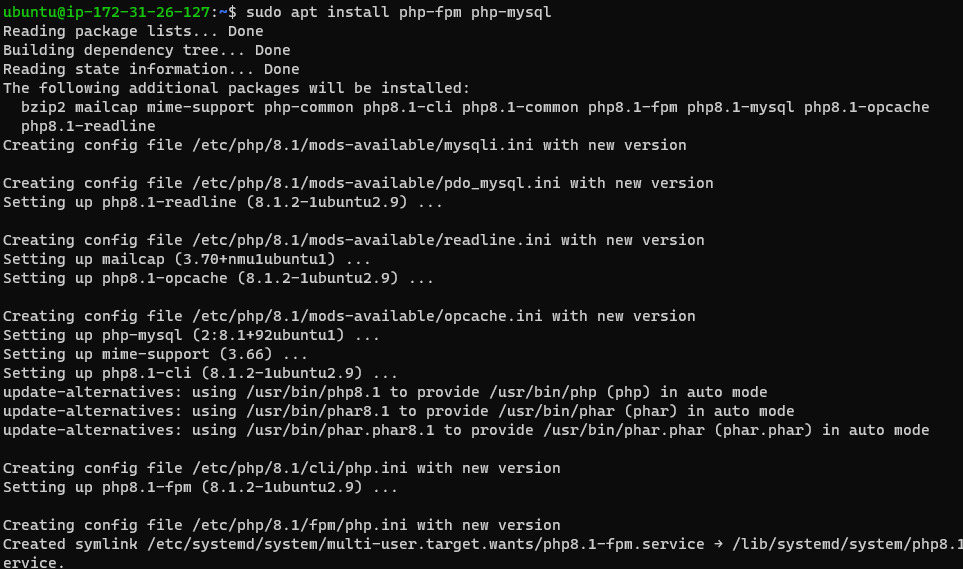

## Step 5 - Configuring nginx to use php processor

> Create the root web directory for projectLEMP
   
    sudo mkdir /var/www/projectLEMP

> Assign ownership of the with the $USER env variable
**Note: The $USER env variable references the current system user.**

    sudo chown -R $USER:$USER /var/www/projectLEMP

> Open a new config file in Nginx's **sites-available** directory using your preferred command-line editor. 

    sudo nano /etc/nginx/sites-available/projectLEMP

> Paste the configuration below in the new file and save.

  #/etc/nginx/sites-available/projectLEMP

```
server {
    listen 80;
    server_name projectLEMP www.projectLEMP;
    root /var/www/projectLEMP;

    index index.html index.htm index.php;

    location / {
        try_files $uri $uri/ =404;
    }

    location ~ \.php$ {
        include snippets/fastcgi-php.conf;
        fastcgi_pass unix:/var/run/php/php8.1-fpm.sock;
     }

    location ~ /\.ht {
        deny all;
    }

}
```

> Activate the configuration 

    sudo ln -s /etc/nginx/sites-available/projectLEMP /etc/nginx/sites-enabled/

> Test configuration for syntax errors

    sudo nginx -t
  
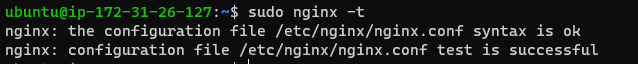


> Disable default nginx host
 
    sudo unlink /etc/nginx/sites-enabled/default

> Reload the nginx server

    sudo systemctl reload nginx

**the new website is active, but the root /var/www/projectLEMP is still empty**
     
> Create an index.html file in that location to test that the virtual host works as expected.
 
   sudo echo 'Hello LEMP from hostname' $(curl -s http://169.254.169.254/latest/meta-data/public-hostname) 'with public IP' $(curl -s http://169.254.169.254/latest/meta-data/public-ipv4) > /var/www/projectLEMP/index.html


> Open the URL in your web browser
 
    http://<Public-IP-Address>:80

    http://44.212.67.132/

  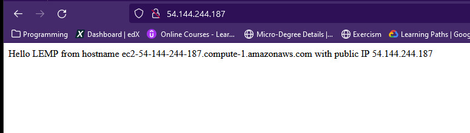

  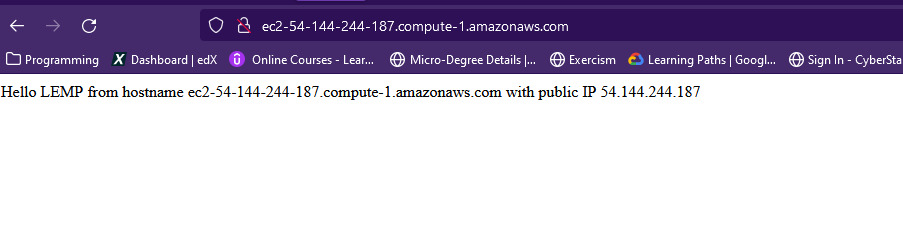


## Step 5 - Testing PHP with nginx

> Create a test PHP file in your document root.
  
    
    sudo nano /var/www/projectLEMP/info.php

> Paste the command in the new file
  
    <?php
    phpinfo();

> Access the page frm the web browser
 
    http://`server_domain_or_IP`/info.php

    http://54.144.244.187/info.php
  
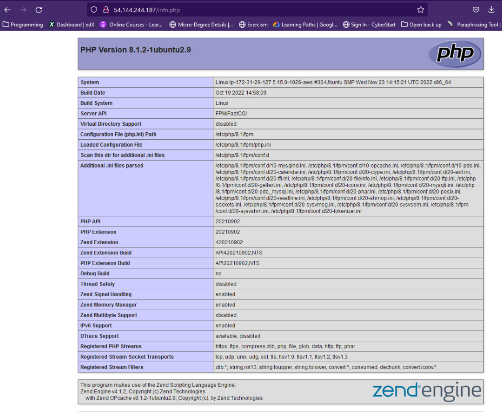


## Step 6 - Retrieving data frm MySQL Databaw the PHP
    
> Connect to MySQL console using the root account

    sudo mysql

> Create a new database
   
    CREATE DATABASE `nginx_database`;
  
>  create a new user and grant him full privileges on the database you have just created.
     
     CREATE USER 'funmibi'@'%' IDENTIFIED WITH mysql_native_password BY 'p@33w0rd';

> Next step allow this user permission over the nginx_database database:

     GRANT ALL ON nginx_database.* TO 'funmibi'@'%';

> Exit the MySQL shell
     
     exit


> Test if the new user has the proper permissions by logging in to the MySQL console again, this time using the custom user credentials

    mysql -u funmibi -p

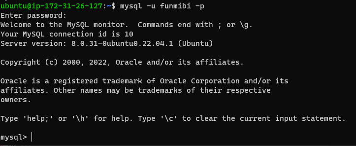

> Show all databases

    SHOW DATABASES;

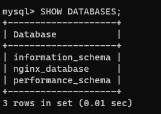

> Create a table named **todo_list**

```SQL
    CREATE TABLE nginx_database.todo_list (
      item_id INT AUTO_INCREMENT,
      content VARCHAR(255),
      PRIMARY KEY(item_id)
    );
```

> Insert a few roww of content in the test table
```SQL
    INSERT INTO nginx_database.todo_list (content) VALUES ("Learn abt devops on darey.io");

    INSERT INTO nginx_database.todo_list (content) VALUES ("Make payment on the darey.io platform");

    INSERT INTO nginx_database.todo_list (content) VALUES ("Get started with the projects");
```
> Confirm data was successfully saved to the db

    SELECT * FROM nginx_database.todo_list;
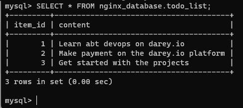

> After confirming data was stored successfully, exit the MySQL console

    exit


> Create a PhP script that will connect to MySQL and query for content frm the db

    nano /var/www/projectLEMP/todo_list.php

> Copy the commands in the new file, Save and close the file.

```PHP
    <?php
    $user = "funmibi";
    $password = "p@33w0rd";
    $database = "nginx_database";
    $table = "todo_list";

    try {
      $db = new PDO("mysql:host=localhost;dbname=$database", $user, $password);
      echo "<h2>TODO</h2><ol>";
      foreach($db->query("SELECT content FROM $table") as $row) {
        echo "<li>" . $row['content'] . "</li>";
      }
      echo "</ol>";
    } catch (PDOException $e) {
        print "Error!: " . $e->getMessage() . "<br/>";
        die();
    }
```

> Access the page frm a web browser

  **Note** output should be the todo list on the webpage

    http://<Public_domain_or_IP>/todo_list.php

    http://54.152.206.174/todo_list.php

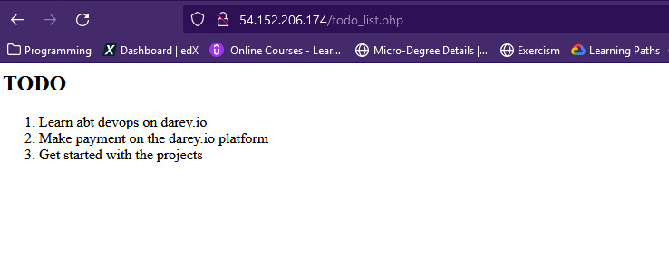
    
