## What is a DBMS
    : A DBMS is system software for creating and managing databases.

    : A DMBS makes it possible for end users to create, store retrieve, query and manage data in a database.

**Types of DBMS**

1. Hierarchical Databases
2. Network Databases
3. Relational Databases
4. Object-oriented Databases
5. Graph Databases
6. ER model Databases
7. Document Databases

**Hierarchical Databases**

    :  In this type of Database, data gets stored in parent-children relationship nodes. Also, the records not only contain the data of it but of their parent and children as well. 

    :  Data gets stored in the form of a collection of fields in which each field contains only one value, i.e., every individual record has only one parent and a parent can have one or more than one children.

    :  To retrieve the data, we need to traverse each tree until we get the desired data.

**Network Databases**

    :  Network database management systems (Network DBMSs) uses network structure to create a relationship between entities.

    :  Network databases are mainly used on a large network of computers and are similar to hierarchical databases differs with one key point that in network databases one node can have a relationship with multiple entities. 

    : In network databases, parents are termed as occupier and children are termed as members. Data in the network database is organized as many-to-many relationships.


**Relational Databases**

    :  Relational Databases are the most popular among all databases.

    :  In this type of database, there is a relationship between data and that is stored in the form of the table of rows and columns, such that row represents record and column represents the attribute.
  
    :  Every individual field represents the data value. In order to query the Relational Databases, Structured Query Language (SQL) is used which includes insertion, deletion, manipulation and search the records.

    : Relational database depicts the relation between two or more tables, but how this relation is made? Through Key Fields. Every row has its unique key field and these key fields are used to connect one table to another one.


**Object-oriented Databases**

    :  Object-Oriented Databases deals with the functionality of the object-oriented programming and it increases the semantics of the C++ and Java.

    : One of the most important advantages of Object-Oriented Database is its ability to mix and match reusable objects. It provides the unbelievable multimedia capability.

**Graph Databases**

    : Graph databases are NoSQL databases and it uses the graphical structure for semantic queries.

    : Data is stored in the form of nodes, edges, and properties in which node is equivalent to a record, the edge is a link between two nodes and properties are additional information added into the nodes.


**ER model Databases**

    :  the ER model is applied as a database. Each row in the table represents one instance of an object type, and each column in a table represents an attribute type.

**Document Databases**

    :  Document databases (DBs) are also a NoSQL database.

    :  It stores data in the form of documents which are key values. Each document makes the relationship of the data with other data elements and attributes.

    :  The specialty of NoSQL data storage is that it provides a faster mechanism for storing and searching for documents.


**NoSQL**

    :  Relational databases, like those of MySQL and PostgreSQL, store data by using an explicit schema. 

    : A schema describes how to write data in the database, particularly describing the structure, types, and structures of tables and records.

    :  In a NoSQL database, users do not define a schema. Instead, they can store data using any structure they wish, with a relational SQL query providing data that users can then use to update that data.

    :  The two types of database systems also provide different ways of accessing the data. Where SQL can be expressed as rows (called field values) and tables (indexes), NoSQL queries allow you to access data as documents (columns) and view data through various perspectives.

    :  By comparison, one of the main differences between relational databases and NoSQL systems is that while relational databases generally support minimal transactions, NoSQL systems allow transactions to run on any row and transaction records. While this sounds like a trivial difference, it is a big step forward in performance and scalability.


### Web Application Framework(s)
    A web framework (WF) or web application framework (WAF) is a software framework that is designed to support the development of web applications including web services, web resources, and web APIs. Web frameworks provide a standard way to build and deploy web applications on the World Wide Web.

### Web Application Frameworks Frontend 

 - React
 - Angular
 - Vue
 - Ember
 - Jquery
 - Semantic-UI Framework


### Web Application Frameworks Backend

| Framework | Programming Lang |
| ----------- | ----------- |
| Django      |   Python    |
| ExpressJS   |   NodeJS    |
| Laravel     |   PHP       |
| Ruby on Rails | Ruby      |
| CakePHP     | PHP         |
| Flask       | Python      |
| Asp. NET    | C#


 ### **What are RESTful APIs**
    A REST API (also known as RESTful API) is an application programming interface (API or web API) that conforms to the constraints of REST architectural style and allows for interaction with RESTful web services. REST stands for representational state transfer and was created by computer scientist Roy Fielding.

### **What's an API?**
    : An API is a set of definitions and protocols for building and integrating application software. It’s sometimes referred to as a contract between an information provider and an information user—establishing the content required from the consumer (the call) and the content required by the producer (the response). For example, the API design for a weather service could specify that the user supply a zip code and that the producer reply with a 2-part answer, the first being the high temperature, and the second being the low.  

    : In other words, if you want to interact with a computer or system to retrieve information or perform a function, an API helps you communicate what you want to that system so it can understand and fulfill the request. 

    : You can think of an API as a mediator between the users or clients and the resources or web services they want to get. It’s also a way for an organization to share resources and information while maintaining security, control, and authentication—determining who gets access to what. 

### **REST**
    : REST is a set of architectural constraints, not a protocol or a standard. API developers can implement REST in a variety of ways.

    : When a client request is made via a RESTful API, it transfers a representation of the state of the resource to the requester or endpoint. This information, or representation, is delivered in one of several formats via HTTP: JSON (Javascript Object Notation), HTML, XLT, Python, PHP, or plain text. JSON is the most generally popular file format to use because, despite its name, it’s language-agnostic, as well as readable by both humans and machines. 

    : Something else to keep in mind: Headers and parameters are also important in the HTTP methods of a RESTful API HTTP request, as they contain important identifier information as to the request's metadata, authorization, uniform resource identifier (URI), caching, cookies, and more. There are request headers and response headers, each with their own HTTP connection information and status codes.

### **Cascading Style Sheets (CSS)**
    : CSS is a style sheet language used for describing the presentation of a document written in a markup language such as HTML or XML (including XML dialects such as SVG, MathML or XHTML).

    : CSS is a cornerstone technology of the World Wide Web, alongside HTML and JavaScript.

    : CSS is designed to enable the separation of content and presentation, including layout, colors, and fonts.

## **LABs**

### Step 1 - Backend Configuration 
> Update ubuntu packages
  
    sudo apt update

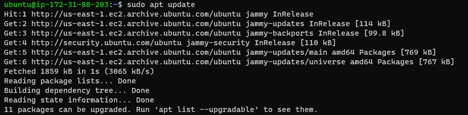

> Updgrade packages
    
    sudo apt upgrade

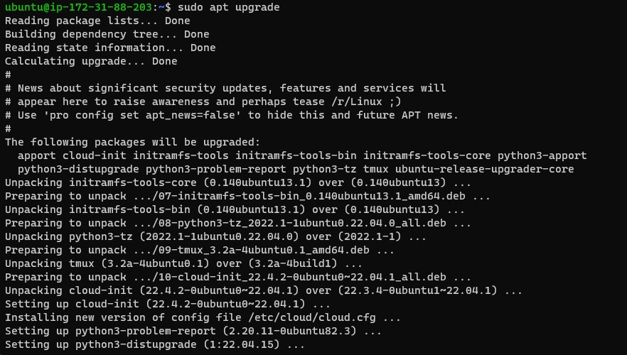

> Get the location of Node.js software from Ubuntu repositories.

    curl -fsSL https://deb.nodesource.com/setup_19.x | sudo -E bash - 

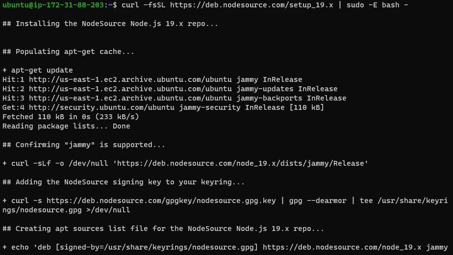

> Install Node.js

    sudo apt-get install -y nodejs

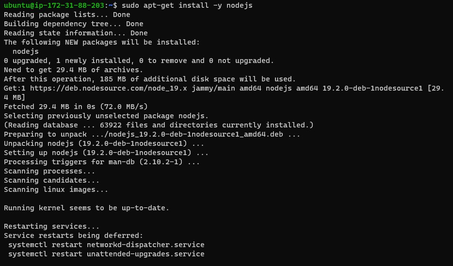

> Verify node installation & version
  
    node -v
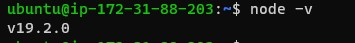

> Verify node installation 

    npm -v

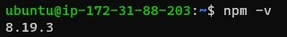

#### **Note: Application code setup**

> Create a new directory for the __'To-Do'__ project.

    mkdir Todo

> Change directory into the Todo directory

    cd Todo

> Initialize project
  
    npm init

    Note: the 'npm init' command creates a file named 'package.json'

    The 'package.json' file containss info about your application and the dependencies that it needs to run.

    Follow the prompt after running the command.

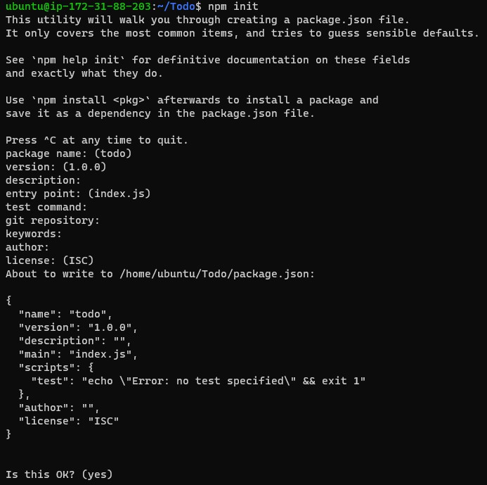

> Install ExpressJs 

   npm install ExpressJs
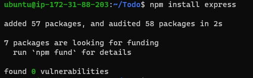

> create new file 'index.js'
   
   touch index.js

> Install dotenv module
  
     npm install dotenv

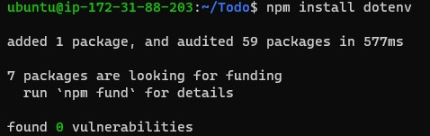

> Open the index.js with vim or nano and paste the code below.
```JAVASCRIPT   
  const express = require('express');
  require('dotenv').config();

  const app = express();

  const port = process.env.PORT || 5000;

  app.use((req, res, next) => {
  res.header("Access-Control-Allow-Origin", "\*");
  res.header("Access-Control-Allow-Headers", "Origin, X-Requested-With, Content-Type, Accept");
  next();
  });

  app.use((req, res, next) => {
  res.send('Welcome to Express');
  });

  app.listen(port, () => {
  console.log(`Server running on port ${port}`)
  });
```   
> Save file and exit

> Start the server from the terminal

    node index.js

> Open the server with ip address or Publicdns on port 5000

     http://<PublicIP-or-PublicDNS>:5000
     http://54.173.221.178:5000/  - PublicIP
     http://ec2-54-173-221-178.compute-1.amazonaws.com:5000/ - PublicDns

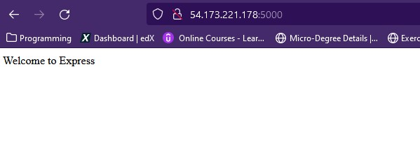

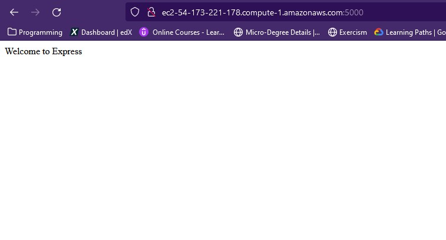    

> To find the Public IP and public DNS name of your server:
  - You can find it in your AWS web console in EC2 details
  - Run curl -s http://169.254.169.254/latest/meta-data/public-ipv4 for Public IP address or curl -s http://169.254.169.254/latest/meta-data/public-hostname for Public DNS name.

## **Routes**

> Create routes directory and cd into it.

    mkdir routes && cd routes

> Create a new file 'api.js' and open with vim or nano
    touch api.js && vim api.js

> Paste the code below into the api.js file

```JAVASCRIPT
  const express = require ('express');
  const router = express.Router();

  router.get('/todos', (req, res, next) => {

  });

  router.post('/todos', (req, res, next) => {

  });

  router.delete('/todos/:id', (req, res, next) => {

  })

  module.exports = router;
```

## **MODELS**
    Note: The To-Do app is going to make use of Mongodb which is a NoSQL database, we need to create a model.

    To create a Schema and a model, install mongoose which is a Node.js package that makes working with mongodb easier.

>  Change directory back to the Todo folder and install mongoose
   
    cd .. && npm install mongoose

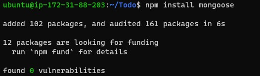


> Create a new directory named 'models' and change dirctory into models and create a new file 'todo.js

    mkdir models && cd model && todo.js

> Open the todo.js file and paste the code below in it.
```JAVASCRIPT
    const mongoose = require('mongoose');
    const Schema = mongoose.Schema;

    //create schema for todo
    const TodoSchema = new Schema({
    action: {
    type: String,
    required: [true, 'The todo text field is required']
    }
    })

    //create model for todo
    const Todo = mongoose.model('todo', TodoSchema);

    module.exports = Todo;
```

> Update our routes in the api.js file to make use of the new model.

> In the routes directory open api.js file with vim,

> delete the code inside with :%d command

> Paste the updated code then save and exit

```JAVASCRIPT
  const express = require ('express');
  const router = express.Router();
  const Todo = require('../models/todo');

  router.get('/todos', (req, res, next) => {

  //this will return all the data, exposing only the id and action field to the client
  Todo.find({}, 'action')
  .then(data => res.json(data))
  .catch(next)
  });

  router.post('/todos', (req, res, next) => {
  if(req.body.action){
  Todo.create(req.body)
  .then(data => res.json(data))
  .catch(next)
  }else {
  res.json({
  error: "The input field is empty"
  })
  }
  });

  router.delete('/todos/:id', (req, res, next) => {
  Todo.findOneAndDelete({"_id": req.params.id})
  .then(data => res.json(data))
  .catch(next)
  })

  module.exports = router;
```

## **MongoDB Database**

> Create a cluster

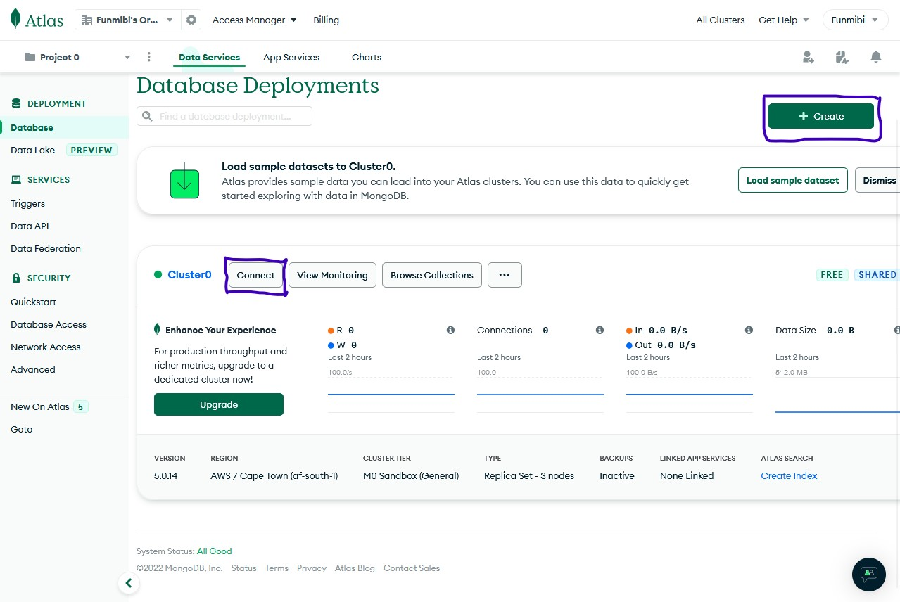

> Editing network access to be able to access the database from anywhere

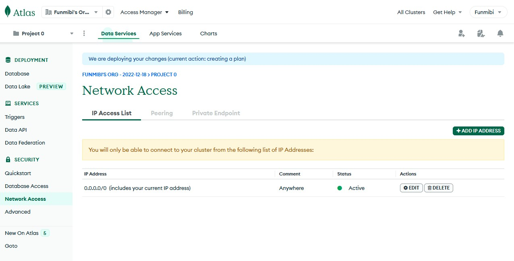

> Get connect string for .env enviroment

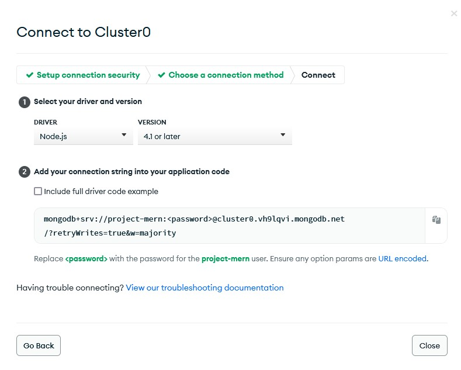

> Create .env file and paste the connect string in it.

    touch .env

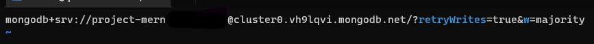

> Save and exit

> Modify the index.js file to use .env so nodejs can connect to the database

    vim index.js

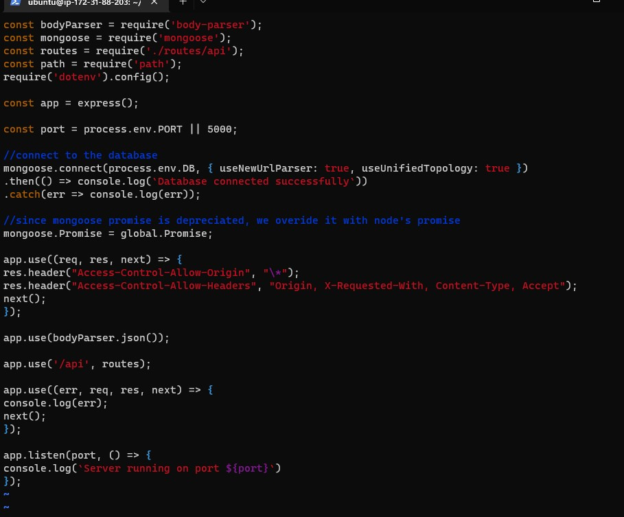

> Start the server using the command

    node index.js

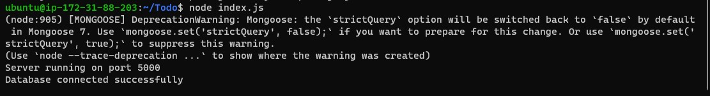

### __Testing Backend code without Frontend using RESTful API__

> Use postman to test our backend code

### Post Request

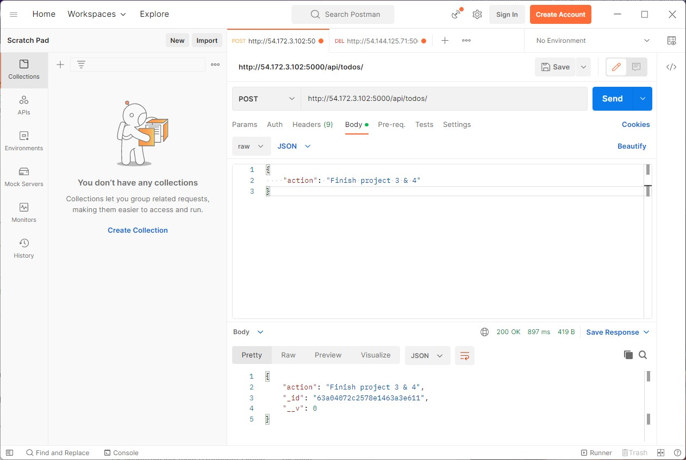

### Get Request

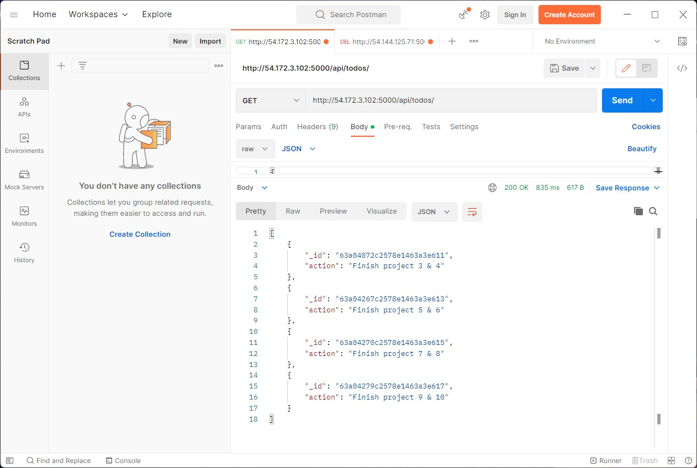

### Delete Request 

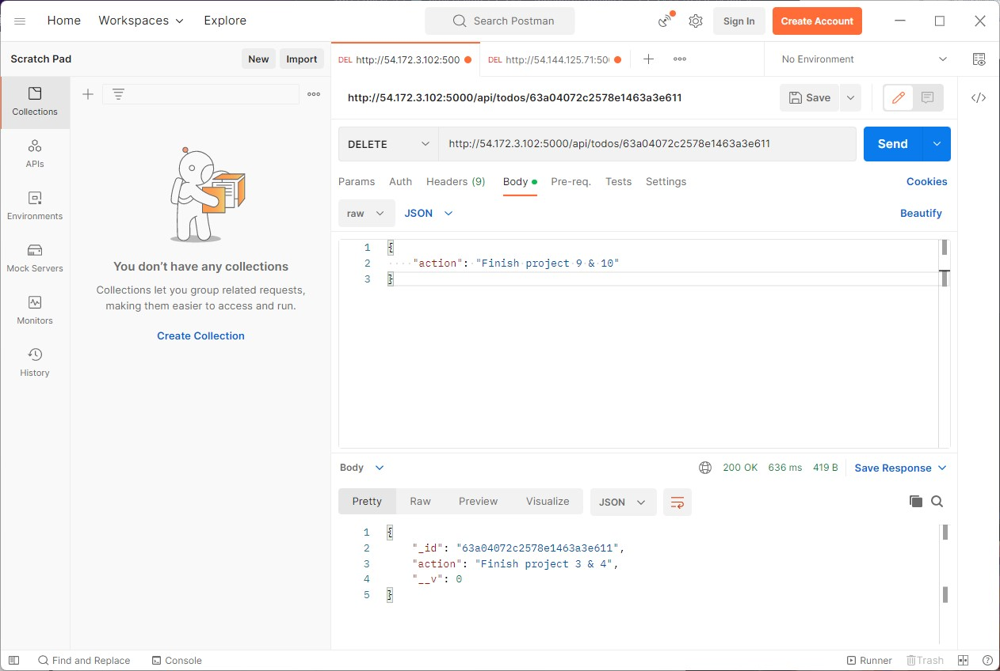
  
### __Step 2 - Frontend Creation

> In the same root directory as your backend code, which is the Todo directory, run:

    npx create-react-app client

**Note: The command above will create a new folder called 'client' where you would add all the React code**

## **Running a React App**

> Installing dependencies 

    npm install concurrently --save-dev

    npm install nodemon --save-dev

> Modifiy package.json file replacing the lines below

```JAVASCRIPT
  "scripts": {
  "start": "node index.js",
  "start-watch": "nodemon index.js",
  "dev": "concurrently \"npm run start-watch\" \"cd client && npm start\""
},
```

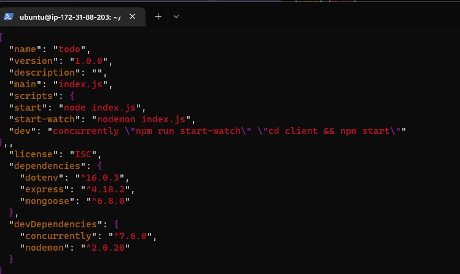

## Configure Proxy in package.json

> Change directory to 'client' directory

     cd client

> Open the package.json file
     
    vim package.json

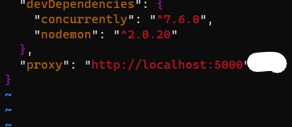

> Start the server
 
    npm run dev

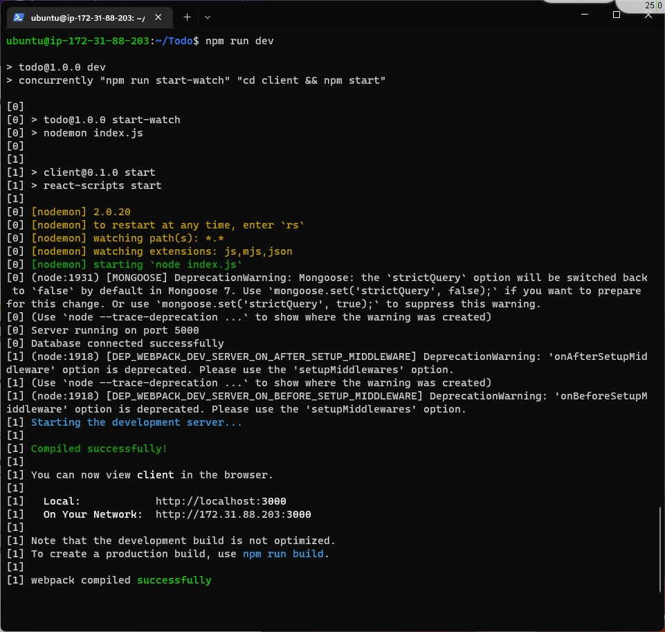

Note: Server listening on port 3000, so enable it on the ec2 instance.

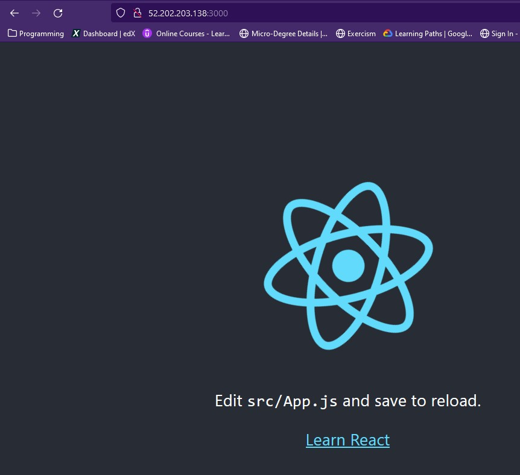 
## Creating a React Component

> Navigate to the 'src' directory and create a new directory 'component'

    cd client && cd src && mkdir components

> Inside the 'components' directory create three files.
 
    touch Input.js ListTodo.js Todo.js

> Open the 'Input.js' file and copy and paste the code below

    vi input.js

```JAVASCRIPT
import React, { Component } from 'react';
import axios from 'axios';

class Input extends Component {

state = {
action: ""
}

addTodo = () => {
const task = {action: this.state.action}

    if(task.action && task.action.length > 0){
    axios.post('/api/todos', task)
        .then(res => {
        if(res.data){
            this.props.getTodos();
            this.setState({action: ""})
        }
        })
        .catch(err => console.log(err))
    }else {
    console.log('input field required')
    }

}

handleChange = (e) => {
this.setState({
action: e.target.value
})
}

render() {
let { action } = this.state;
return (
<div>
<input type="text" onChange={this.handleChange} value={action} />
<button onClick={this.addTodo}>add todo</button>
</div>
)
}
}

export default Input
```

## Making use of Axios
#### Axio is a Promise based HTTP client for the browser and node.js

>  Navigate to the clients directory and install axios

    cd ../.. npm install axios

## Coffee Break! :coffee:

> Navigate to the 'components' directory
> Open the ListTodo.js file and paste the code below in it.

    vim ListTodo.js
   

```JAVASCRIPT
import React from 'react';

const ListTodo = ({ todos, deleteTodo }) => {

return (
<ul>
{
todos &&
todos.length > 0 ?
(
todos.map(todo => {
return (
<li key={todo._id} onClick={() => deleteTodo(todo._id)}>{todo.action}</li>
)
})
)
:
(
<li>No todo(s) left</li>
)
}
</ul>
)
}

export default ListTodo

Then in your Todo.js file you write the following code

import React, {Component} from 'react';
import axios from 'axios';

import Input from './Input';
import ListTodo from './ListTodo';

class Todo extends Component {

state = {
todos: []
}

componentDidMount(){
this.getTodos();
}

getTodos = () => {
axios.get('/api/todos')
.then(res => {
if(res.data){
this.setState({
todos: res.data
})
}
})
.catch(err => console.log(err))
}

deleteTodo = (id) => {

    axios.delete(`/api/todos/${id}`)
      .then(res => {
        if(res.data){
          this.getTodos()
        }
      })
      .catch(err => console.log(err))

}

render() {
let { todos } = this.state;

    return(
      <div>
        <h1>My Todo(s)</h1>
        <Input getTodos={this.getTodos}/>
        <ListTodo todos={todos} deleteTodo={this.deleteTodo}/>
      </div>
    )

}
}

export default Todo;
```
> Save and exit


> Modify the App.js file

> Copy and paste the code below

    cd ..
    vi App.js

```JAVASCRIPT
import React from 'react';

import Todo from './components/Todo';
import './App.css';

const App = () => {
return (
<div className="App">
<Todo />
</div>
);
}

export default App;
```
> Save and exit

> Navigate to the src directory and open the App.css file
  
    vim App.css

> Paste the code below in the App.css file

```CSS
.App {
text-align: center;
font-size: calc(10px + 2vmin);
width: 60%;
margin-left: auto;
margin-right: auto;
}

input {
height: 40px;
width: 50%;
border: none;
border-bottom: 2px #101113 solid;
background: none;
font-size: 1.5rem;
color: #787a80;
}

input:focus {
outline: none;
}

button {
width: 25%;
height: 45px;
border: none;
margin-left: 10px;
font-size: 25px;
background: #101113;
border-radius: 5px;
color: #787a80;
cursor: pointer;
}

button:focus {
outline: none;
}

ul {
list-style: none;
text-align: left;
padding: 15px;
background: #171a1f;
border-radius: 5px;
}

li {
padding: 15px;
font-size: 1.5rem;
margin-bottom: 15px;
background: #282c34;
border-radius: 5px;
overflow-wrap: break-word;
cursor: pointer;
}

@media only screen and (min-width: 300px) {
.App {
width: 80%;
}

input {
width: 100%
}

button {
width: 100%;
margin-top: 15px;
margin-left: 0;
}
}

@media only screen and (min-width: 640px) {
.App {
width: 60%;
}

input {
width: 50%;
}

button {
width: 30%;
margin-left: 10px;
margin-top: 0;
}
}
```

> Save and exit

> Open the index.css css file

    vim index.css

> Paste the code below in the index.css file

```CSS
body {
margin: 0;
padding: 0;
font-family: -apple-system, BlinkMacSystemFont, "Segoe UI", "Roboto", "Oxygen",
"Ubuntu", "Cantarell", "Fira Sans", "Droid Sans", "Helvetica Neue",
sans-serif;
-webkit-font-smoothing: antialiased;
-moz-osx-font-smoothing: grayscale;
box-sizing: border-box;
background-color: #282c34;
color: #787a80;
}

code {
font-family: source-code-pro, Menlo, Monaco, Consolas, "Courier New",
monospace;
}
```
> Save and exit

> Navigate back to the Todo directory

    cd ../..

> Run the command from the Todo directory
 
    npm run dev

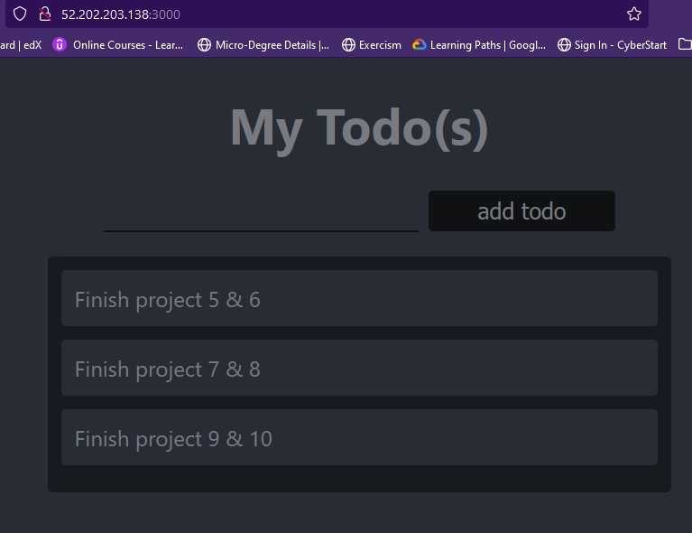